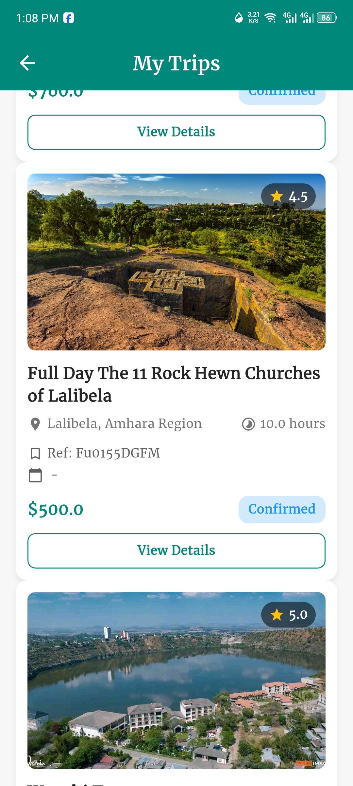
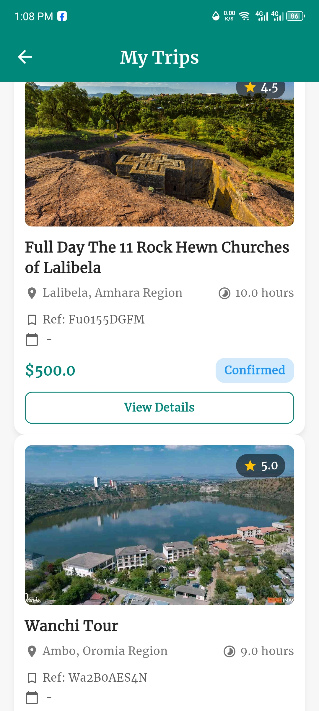
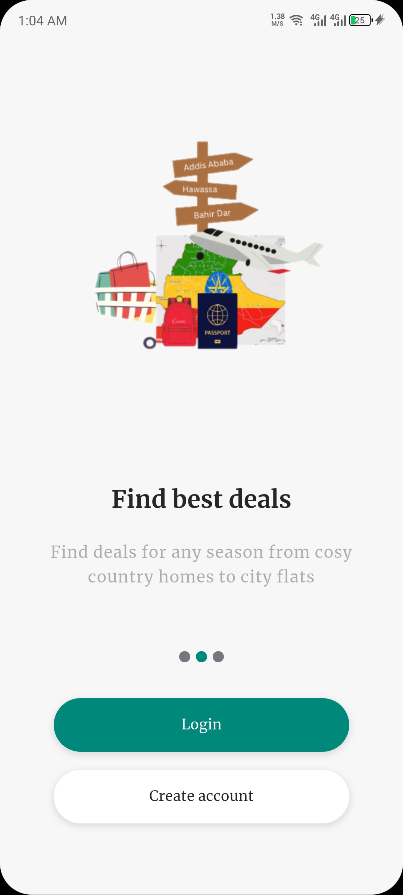

<!-- Profile Banner -->

  

# 👋 Hey, I'm **Yaduma Lechisa**

  🎓 Final Year Software Engineering Student @ Haramaya University  
  💡 Passionate about full-stack development & real-world problem solving  
  📱 Currently working on: <strong>Visit Ethiopia</strong> – a tourism app built with Flutter + Firebase  
  🔬 Exploring: AI features, Offline-first design, Firebase Cloud Messaging (FCM)

---

## ⚙️ Tech Stack

  
  
  
  
  
  
  

---

## 🌟 Featured Project

### 🚀 Visit Ethiopia  
A social media–inspired mobile app designed to promote Ethiopian tourism.  
**Tech Used**: Flutter, Firebase (Realtime DB, Offline Sync, FCM)  
🔗 [GitHub Repo](https://github.com/kusalechisa/visit-ethiopia) | 📱 [Demo Video](#)

  

---

## 📊 GitHub Stats

  
  

  

---

## 📝 Blog & Insights

I occasionally write about software development, tech trends, and learning strategies.  
🔗 [Read my blog](https://kusalechisa.netlify.app)

---

## 📸 App Screenshots – Visit Ethiopia

  
  
  
  
  
  
  
  
  
  
  
  
  
  
  

---

## 📬 Let's Connect

  
  
  

---

  <em>"Code is like humor. When you have to explain it, it’s bad." – Cory House</em>

  ⭐ Thanks for visiting! Feel free to star any project you find useful.

