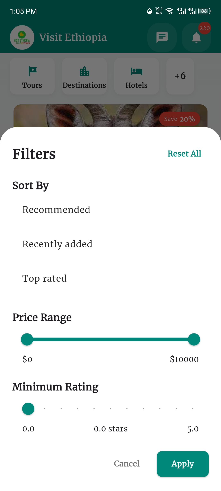
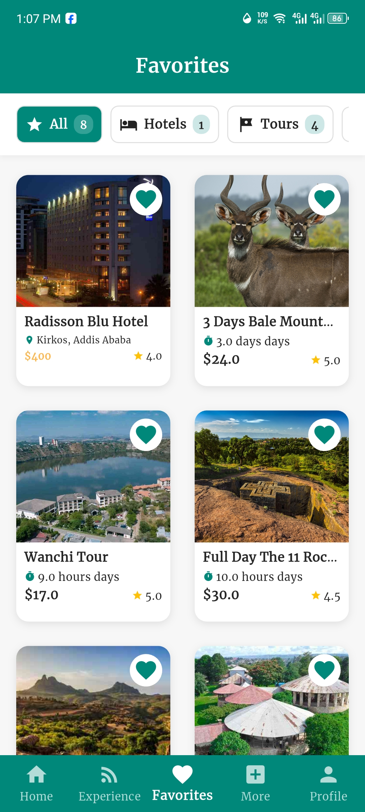

# Yaduma Lechisa 👨‍💻

  

## About Me 🎯

> Final Year Software Engineering Student @ Haramaya University | Full-Stack Developer | Flutter Enthusiast

Currently focused on building **Visit Ethiopia** – A tourism app built with Flutter and Firebase, exploring AI features, offline-first design, and Firebase Cloud Messaging.

## Tech Stack 🛠️

  
  
  
  
  
  
  

## Featured Projects 🚀

### Visit Ethiopia

  

A social media–inspired mobile app promoting Ethiopian tourism.

**Features:**
- 📱 Cross-platform mobile app
- 🔄 Real-time synchronization
- 📍 Location-based services
- 🔔 Push notifications
- 💾 Offline-first architecture

**Tech Stack:**
- Flutter for UI/UX
- Firebase Realtime Database
- Firebase Cloud Messaging
- Offline Sync Capabilities

[🔗 GitHub Repository](https://github.com/kusalechisa/visit-ethiopia) | [📱 Live Demo](#)

### Feedback & Corruption Suggestion System

  

A comprehensive web-based platform developed for the Ethiopian Ministry of Innovation and Technology to gather citizen feedback and report corruption within public offices. The system implements secure authentication and real-time data processing to ensure transparency and accountability.

**Features:**
- 🔐 OTP Verification for secure user authentication
- 📊 Interactive Data Visualization Dashboards
- 🔒 Role-based Access Control
- 📱 Responsive Design for all devices
- 📈 Real-time Analytics and Reporting
- 🔔 Automated Notification System
- 📝 Anonymous Submission Option
 

**Tech Stack:**

  
  
  
  
  
  

**Key Achievements:**
- 🏆 Implemented secure data encryption for sensitive information
- 📈 Reduced response time to citizen complaints by 60%
- 🔒 Successfully handled over 10,000 secure submissions
- 🌐 Integrated with government systems for seamless workflow

[🔗 GitHub Repository](https://github.com/kusalechisa/feedback) | [🌐 Live Demo] 

## GitHub Stats 📊

  
  

  

## App Showcase 📱

  
  
  
  
  

## Mini Projects 🎯

- **🎨 Python Graphics Engine** – Object-oriented design for drawing and animation
- **📚 Library Management System** – Python-based CLI tool for book records
- **🌐 Portfolio Website** – Modern web showcase built with HTML, CSS, JavaScript

## Connect With Me 🤝

  
  
  

---

  <em>"Code is like humor. When you have to explain it, it's bad." – Cory House</em>
    
  ⭐ Thanks for visiting! Feel free to star any project you find useful.

